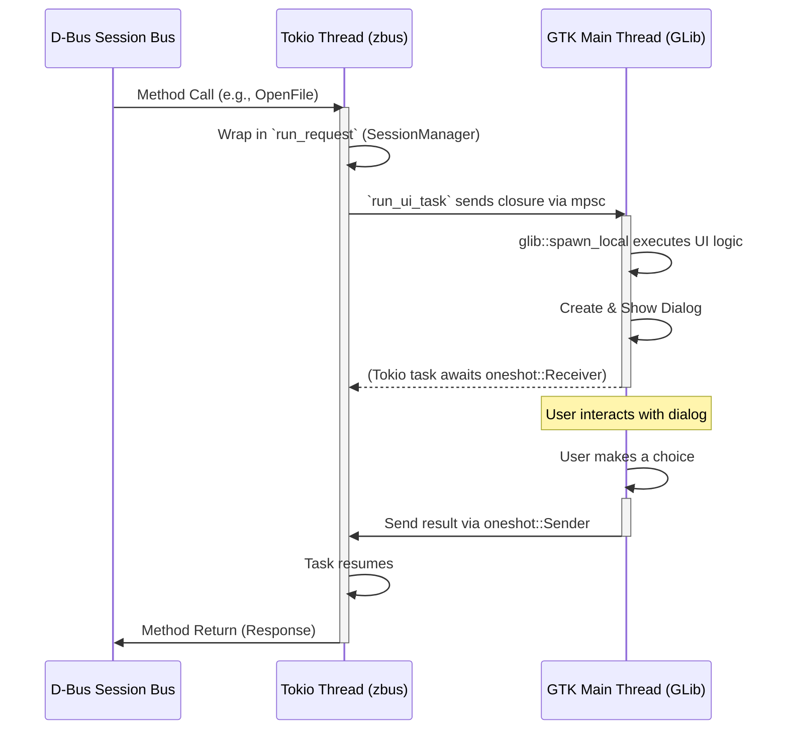

# xdg-desktop-portal-gtk4

A GTK4-based backend for [xdg-desktop-portal](https://github.com/flatpak/xdg-desktop-portal).

Enables sandboxed applications (like Flatpaks and Snaps) to securely interact with the host system, providing native GTK4 dialogs for file picking, app choosing, and more. Use this as your primary portal backend on Wayland compositors (like Sway, Hyprland) or X11 to benefit from modern GTK4 features like updated UI elements and native file picker thumbnails.


## Supported Portals

| Portal Interface  | Description                                                   |
| ----------------- | ------------------------------------------------------------- |
| `Access`          | Prompting for device/resource access                          |
| `Account`         | Providing user account information                            |
| `AppChooser`      | Selecting an application to open a file or URI                |
| `Clipboard`       | Bridging clipboard access between sandboxes and host          |
| `DynamicLauncher` | Managing dynamic desktop launchers                            |
| `Email`           | Composing emails                                              |
| `FileChooser`     | Opening and saving files (with native GTK4 UI)                |
| `Inhibit`         | Inhibiting session state (like sleep or logout)               |
| `Lockdown`        | Querying locked-down features                                 |
| `Notification`    | Displaying desktop notifications                              |
| `Print`           | Printing documents                                            |
| `Settings`        | Reading desktop settings (such as color-scheme for dark mode) |
| `USB`             | Managing USB device access                                    |

## Dependencies

**Build:** Rust >= 1.92, `pkg-config`, `make`, GTK 4, GLib 2.0  
**Runtime:** `xdg-desktop-portal`, GVfs/GIO thumbnail support, and installed thumbnailers (see below)

## Thumbnail Requirements

`xdg-desktop-portal-gtk4` does not generate thumbnails itself. It uses GTK4's file chooser, which asks GIO/GVfs for thumbnail metadata (`thumbnail::path`). GVfs/GLib then looks up thumbnails in the XDG thumbnail cache (`$XDG_CACHE_HOME/thumbnails` or `~/.cache/thumbnails`) and returns them to GTK.

If thumbnails are missing, the most common cause is missing thumbnailer infrastructure (service + `.thumbnailer` registrations), not a FileChooser UI bug in this project.

### Required platform components

- **Thumbnail cache lookup:** provided by GLib/GIO/GVfs
- **Thumbnail generation:** external thumbnailer implementation
- **Thumbnailer registration:** `.thumbnailer` files under `/usr/share/thumbnailers`

### Typical package requirements by distro

- **Arch Linux**
  - `gdk-pixbuf2` (provides `gdk-pixbuf-thumbnailer` for image formats)
  - `tumbler` (thumbnailer service)
  - PDF provider for thumbnailer stack (commonly via `poppler`/desktop PDF thumbnailer package)
- **Fedora**
  - `gdk-pixbuf2`
  - `tumbler` (or desktop thumbnailer equivalent)
  - PDF thumbnailer package (Poppler-based)
- **NixOS**
  - Enable a thumbnailer service (for example `services.tumbler.enable = true;`)
  - Include image/PDF thumbnailer providers in system packages

### Quick diagnostics

```bash
# Check registered thumbnailers
ls /usr/share/thumbnailers

# Check thumbnail cache
find ~/.cache/thumbnails -type f | head

# Run with debug output
G_MESSAGES_DEBUG=all RUST_LOG=debug xdg-desktop-portal-gtk4 --replace
```

## Installation

### Standard Build (Quick Start)

Build the binary with Cargo and install the integration files using Meson:

```bash
cargo build --release

# Install the binary, DBus services, systemd units, and portal configurations
sudo make install PREFIX=/usr
```

> [!NOTE]
> For a complete list of dependencies, advanced build configurations, and CI details, please see **[BUILD.md](./BUILD.md)**.

### Nix / NixOS

A Flake is provided for Nix users:

```bash
nix build .#xdg-desktop-portal-gtk4
nix develop # For a configured development shell
```

**NixOS Configuration:**

```nix
{ inputs, pkgs, ... }: {
  xdg.portal = {
    enable = true;
    extraPortals = [
      inputs.xdg-desktop-portal-gtk4.packages.${pkgs.stdenv.hostPlatform.system}.xdg-desktop-portal-gtk4
    ];
    config.common.default = [ "gtk4" ];
  };
}
```

## Configuration

To make your compositor use this backend, configure `xdg-desktop-portal`. Create or edit `~/.config/xdg-desktop-portal/portals.conf`:

```ini
[preferred]
default=gtk4
```

To only use it for specific portals (like the FileChooser), while keeping another backend as default:

```ini
[preferred]
default=hyprland
org.freedesktop.impl.portal.FileChooser=gtk4
```

Apply the changes:

```bash
systemctl --user restart xdg-desktop-portal
```

## Logging & Debugging

The daemon logs directly to the systemd journal using `tracing-journald`.

Enable debug logging via environment variables:

```bash
# Start manually for debugging
RUST_LOG=debug xdg-desktop-portal-gtk4
```

View background service logs:

```bash
journalctl --user -u xdg-desktop-portal-gtk4 -f
```

## Compilation Features

Portals can be selectively disabled at compile-time to reduce binary size. By default, **all portals** are enabled.

Disable default features in Cargo to build only what you need:

```bash
cargo build --release --no-default-features --features "file_chooser,settings"
```

_(See `Cargo.toml` for the full list of portal features)._

## Development & Architecture

`xdg-desktop-portal-gtk4` bridges the asynchronous, multi-threaded world of D-Bus with the single-threaded, thread-affine world of GTK 4. 

### High-Level Overview

The system strictly separates D-Bus communication from UI rendering to prevent blocking either subsystem. It achieves this by utilizing two primary threads:

1. **GTK Main Thread**: The main process thread. It initializes GTK, runs the GLib `MainLoop`, and handles all widget creation, rendering, and window events.
2. **Tokio Background Thread**: A dedicated OS thread running a single-threaded (`current_thread`) Tokio async runtime. It owns the `zbus` connection, the object server, and handles all incoming D-Bus requests and background async tasks. CPU-heavy or blocking tasks are offloaded to dedicated background threads via `tokio::task::spawn_blocking`.

### Mermaid Diagram



### Component Responsibilities and Integration

- **GTK & GLib**: At startup, `Ui::new()` establishes a `MainContext` and creates an `unbounded_channel` (`UiProxy`). The receiving end is attached to the GLib main loop via `spawn_local`, which continually executes received closures on the main thread.
- **Tokio & zbus**: The background Tokio thread accepts D-Bus requests. Because GTK 4 objects are `!Send` and `!Sync`, Tokio tasks *never* touch UI elements directly.
- **The Bridge (`run_ui_task`)**: When a D-Bus handler needs UI interaction, it calls `run_ui_task`. This sends a closure over the `UiProxy` channel to the GTK thread. The closure receives a `oneshot::Sender` to transmit the user's decision back to the suspended Tokio task.

### Concurrency Model

- **`std::sync::mpsc`**: Used during startup to block the main thread until the Tokio thread successfully acquires the D-Bus name.
- **`tokio::sync::oneshot`**: Used for transferring results from the GTK thread back to Tokio, and for passing shutdown/cancellation signals.
- **`tokio::sync::mpsc::unbounded_channel`**: Used by `UiProxy` to queue closures for the GTK main loop.
- **`parking_lot::Mutex`**: Used for shared synchronous state (like session tracking), minimizing lock overhead in a fail-fast architecture without lock poisoning.

### Design Rationale

This architecture isolates I/O-bound D-Bus operations from the UI thread. Using closures dispatched over a channel keeps GTK thread-affinity guarantees intact while avoiding complex `Mutex` sharing of UI widgets. It is highly resilient: if the D-Bus name is lost (e.g., replaced by another portal instance), the Tokio thread receives the signal and gracefully initiates a shutdown of the GTK main loop.

### Additional Subsystems

- **Internationalization (i18n):** Uses `rust-i18n`. Locales are stored in `locales/`.

## Acknowledgements & License

Originally created by [mahkoh](https://github.com/mahkoh). Inspired by the KDE and GNOME portal implementations.

For a comprehensive list of other available backend implementations (such as `xdg-desktop-portal-kde`, `xdg-desktop-portal-gnome`, `xdg-desktop-portal-wlr`, `xdg-desktop-portal-hyprland`, `xdg-desktop-portal-cosmic`, etc.), please see the [Arch Linux Wiki](https://wiki.archlinux.org/title/XDG_Desktop_Portal#List_of_backends_and_interfaces) or the official [Flatpak Portal Documentation](https://flatpak.github.io/xdg-desktop-portal/docs/).

Licensed under the **GNU Lesser General Public License v2.1**.
